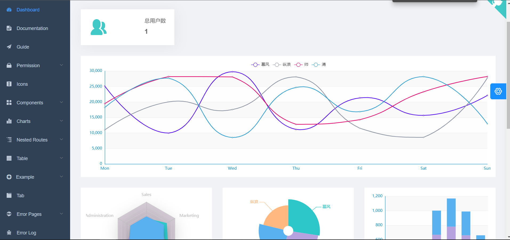

# xxx

## ✨Features-持续更新
> django+vue，CS系统，前后端分离，底层系统自定义构建的基础上和[Vue_web](https://github.com/StrayCamel247/Vue_web)进行接口联调，接口展示。同时运行两个项目可进行数据展示。
> 此版本的最终目的在于开发完成用户管理，数据可视化，算法/量化分析可视化等功能的前后端分离系统。
> 如有问题欢迎[ISSUE](https://github.com/StrayCamel247/Django_web/issues)
### [🚓项目运行]
> 项目采用uwsgi工具可以启动，通信流程为：`浏览器-http协议-nginx服务器-uwsgi协议-uwsgi服务器-uwsgi协议-python_wsgi_module_wsgi（python专用协议）-python_app（python应用）`
- 命令行启动
  - `python manage.py runserver` or `python manage.py runserver 0.0.0.0:8000 --noreload`

- uwsgi启动
  - 安装虚拟环境，并设置好参数，注意修改下方参数中虚拟环境/项目文件目录是否正确
  - `dev.ini` 文件可直接启动并运行在后台
  - `uwsgi.ini` debug运行
### [🦍Postman接口文档](https://explore.postman.com/templates/12957/djangoweb)

> 开发完后再进行完善

### 😋Version_V2.1

#### 前后端联调
> 数据基本由faker假数据生成
- [x] 预览
  - [x] 本地预览：
  - [ ] 在线预览：（服务器选购中ing）
- [x] apps\dashboard: Vue_web仪表盘功能
  - [x] kpi各个指标根据kpi_indicator接口工厂分配查询各指标，分多次请求查询各个kpi值
  - [x] 仪表盘各类图标通过接口获取数据展示

#### apps-后端系统 

- [x] data
  - [x] **iris_data数据可视化接口**:`apps\data\views.py`

- [x] data_analysis: 使用简单的numpy，pandas复现算法或者模型，并通过接口返回演示
  - [x] **Apriori算法实现**:`apps\data_analysis\models\apriori.py`
  - [x] **FPgrowth算法实现**:`apps\data_analysis\moduls\FPgrowth\handler.py`
  - [x] **SVM算法实现（预测）**:`apps\data_analysis\moduls\svm\handler.py`
  - [ ] 开发中...

- [x] models_sklearn_spark: 机器学习和各种模型算法小demo复现，并通过接口返回演示
  > 开发中...

- [x] models_tensorflow2: 使用tensorflow2复现论文，比赛等，并通过接口返回演示
  > 开发中...

- [x] utils: 网站系统功能
  - [x] **创建网站数据类型，用于数据校验**:`apps\types.py`
  - [x] **结合wsme数据校验并扩展自定义数据结构，结合signature装饰器对接口的数据进行数据校验**:`apps\types.py`
  - [x] **自定义signature装饰器，应用于view模板，校验接口传参**:`apps\utils\wsme\signature.py`
  - [x] **自定义彩色日志系统，构建方法打印日志装饰器**:`apps\utils\log\handler.py`
  - [x] **继承rest framework框架的统一的异常处理**:`apps\utils\decorators\http.py`
  - [x] **重构django http请求方式校验，而不是再urls.py文件配置**:`apps\utils\decorators\http.py`
    - [x] 支持将用户指定url和request methods，并自动将url注册到apis连接下
    - [x] 支持对request.user校验
    - [x] 支持对jwt的token校验（jwt生辰方式见jwt登陆验证）
      - [x] 获得token校验后会更新token，将数据插入到返回的json中

- [x] jwt登陆验证
  - [x] **关闭django的csrftoken验证**，开发简单的jwt登陆验证，绕过drf框架，直接使用django原生系统:`apps\utils\jwt`
  - [x] **登陆接口化，继承rest framework框架登陆路由，扩展使用jwt原理扩展接口**:`apps\accounts\views.py`
    > https://django-rest-framework-simplejwt.readthedocs.io/en/latest/token_types.html#token-types; Simple JWT provides two different token types that can be used to prove authentication; 两种方式均可获得对应的token和user信息（user信息使用的序列化功能在
    - [x] “access”, “sliding”：`apps\accounts\views.py`:token_obtain_pair()/token_access_refresh()
    - [x] “refresh”：`apps\accounts\views.py`:token_obtain_sliding_login()/token_refresh()
  - [x] **将django-rest-framework-simplejwt中的CBV视图转换为FBV视图handlers**:`apps\accounts\handler.py`
  - [x] **使用jwt和session联合验证** 

- [x] apis
  - [x] **获得所有urls**:`apps\apis\views.py`

#### ele_admin 后端扩展功能
> 结合前端界面[Vue_web](https://github.com/StrayCamel247/Vue_web)进行开发调试

- [x] `ele_admin\ele_admin_dashboard`管理界面仪表盘界面
  > 数据由python的faker包生成，具体逻辑看代码
  - [x] 前端查询展示的kpi 指标
  - [x] kpi值接口  根据 indicator 传入参数不同请求不同的 handler
    - [x] 查询系统总共用户数
  - [x] 前端查询展示 `dashboard/TransactionTable`
  - [x] 前端查询展示 `dashboard/barChart`
  - [x] 前端查询展示 `dashboard/BoxCard`
  - [x] 前端查询展示 `dashboard/LineChart`
  - [x] 前端查询展示 `dashboard/PieChart`
  - [x] 前端查询展示 `dashboard/RaddarChart`
  - [x] 前端查询展示 `dashboard/TodoList`
- [ ] `ele_admin\ele_admin_interface`接口（数据库操作）测试
### 👻[Version_V2.0](https://github.com/StrayCamel247/Django_web/releases/tag/v2.0.0)
> django+vue，CS系统，系统底层构建等。

### [🦄Version_V1.0](https://github.com/StrayCamel247/Django_web/releases/tag/v1.0

> 网站采用传统的django MVT模式构建，使用bootstrap作为前端框架，用户管理、文章管理、评论系统、留言系统以及工具系统初步完善

<!-- ## 🐾网站

### 项目运行

- 让项目在服务器运行，参考文章：[Nginx + Gunicorn 服务器配置 Django](https://leetcode-cn.com/circle/article/6DA7GA/)
- 服务器可使用`nohup bash gunicorn_start.sh`挂在后台运行。
- 一键清除正在后台运行的config项目，使用命令`bash kill_pid.sh`

- 本地环境运行项目：
    - 安装pip需求包`pip install -r requirements.txt`
    -  更改`settings.py`文件中的数据库配置信息，使用本地`db.sqlite3`文件作数据库。
    - 构建项目所需要的数据库，连接信息更改请在`config/settings.py`文件中进行更改
    - 链接新的数据库或者更换数据库需要运行`python manage.py makemigrations & python manage.py migrate`
    - 集合项目依赖包中的静态文件：`python manage.py collectstatic`
    - 压缩文件:`python manage.py compress`
 -->

### 🙃常见安装项目 bug

- 都用django了为啥不用orm建？
  - 表结构修改/插入数据比较频繁，切插入的数据部分为后端自定义，建议使用navicat访问，手工插入/修改（或者写脚本）
- 接口post请求莫名变成get请求:
  - [参考](https://blog.csdn.net/qq_37228688/article/details/89414576)
  - pots请求在url定向的时候，如果末尾不是‘/’，会被系统重定向到带‘/’的url，即301，然后空的请求被重定向，就变成了get
  - 在url末尾加上`/`即可解决。

- `ImportError: PILKit was unable to import the Python Imaging Library. Please confirm it s installe...`
  - 安装pillow库：`pip install pillow`

- `ModuleNotFoundError: No module named 'compressor'`
  - 原因是安装django_compressor时的依赖包rcssm出了问题，重新安装rcssm包
  - `pip install rcssmin --install-option="--without-c-extensions"`

- `ImportError: cannot import name 'connections' from 'haystack' `
  - 常见处理方法；写在自动安装的依赖包`pip uninstall haystack`，如果还不能解决，重新卸载并安装djang-haystack。
- Linux系统django-haystack库安装失败
  - python比较好的地方就在于，出现异常抛出的异常上下文信息比较明确，能一眼看出问题所在，看了一下异常报错，原因在于当前虚拟环境下缺少setuptools_scm库，django-haystack的安装依赖这个库。`python -m pip install setuptools_scm`
  
- `ImportError: cannot import name 'ChineseAnalyzer' from 'jieba.analyse' `
  - 安装依赖包`whoosh`，其实在requirement里面已经有了，但是估计时没安装成功吧。再安装一次就好了

- `ModuleNotFoundError: No module named 'user_agent'`
  - 这个包直接安装就好，` pip install user_agent`

- 数据库迁移/项目运行bug：`ValueError : unsupported pickle protocol: 5`
  - 这个bug根据pick协议，我们的查询功能whoosh功能时当我们访问这个页面，就将信息缓存下来，由于服务器py版本和win版本不一样可能会导致这个问题，解决方法就是删除项目中`apps\search\whoosh_index`文件夹中的所有文件。

<!-- ### 项目stars曲线图
 -->